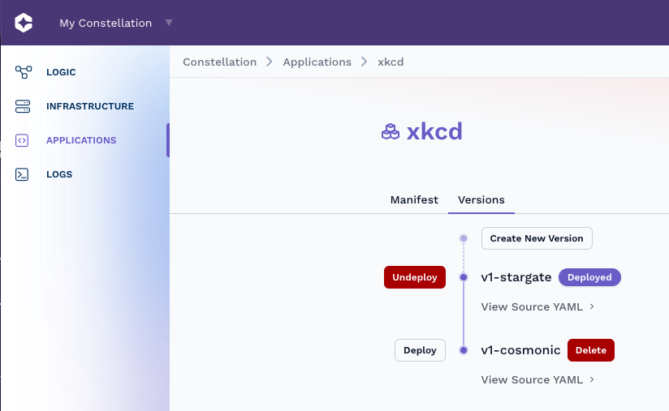
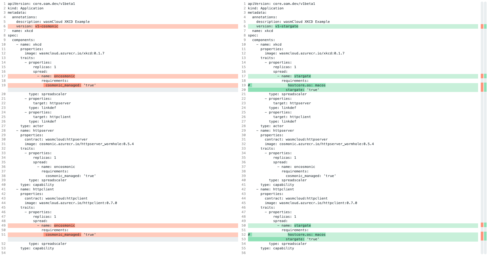

# Awesome Cosmonic
Awesome projects and source code for the Things To Build section on https://cosmonic.com/docs/category/things-to-build.

| Deployment  | Link | Topology |
| ------------- | ------------- | ------------- |
| XKCD Generator on Cosmonic  | [](https://new.cosmonic.app/?yaml=https://raw.githubusercontent.com/cosmonic/awesome-cosmonic/main/xkcdgenerator/xkcd-generator-cosmonic.wadm) | This example will deploy the XKCD actor, HTTP Client Provider, and HTTP Server Provider all on Cosmonic.  |
| XKCD Generator on Stargate  | [](https://new.cosmonic.app/?yaml=https://raw.githubusercontent.com/cosmonic/awesome-cosmonic/main/xkcdgenerator/xkcd-generator-stargate.wadm) | This example will deploy the XKCD actor & HTTP Client Provider on a remote startgate node, and the HTTP Server Provider on Cosmonic. In order for this manifest to work you will need at least one stargate host deployed.  |

# How does it work?
One of the powerful things about Cosmonic is that your basic application architecture can be deployed to dramatically different application topologies all without changing or modifying your architecture.  In the simple examples below we use [Open Application Manifest WADM Manifests](https://github.com/wasmCloud/wadm) to automatically deploy applications to Cosmonic.

Some manifests require multiple Cosmonic hosts connected to your Constellation. Please follow the [Cosmonic Getting Started Guide](https://cosmonic.com/docs/user_guide/cli/getting_started) to deploy a host or simply:

```bash -c "$(curl -fsSL https://cosmonic.sh/install.sh)"```

## Host Labels
Just like Kubernetes Cosmonic uses labels as a powerful mechanism for deployments.  There are a handful of labels that are automatically defined by default for you depending on where the host is executing:

| Label  | Hosts | Definition |
| ------------- | ------------- | ------------- |
| `hostcore.arch=aarch64` | ALL | CPU Architecture |
| `hostcore.os=linux` | ALL | Host OS |
| `hostcore.osfamily=unix` | ALL | Host OS Family |
| `cloud=cosmonic` | Cosmonic | Hosts running inside of Cosmonic Cloud |
| `cosmonic_managed=true` | Cosmonic | Hosts managed by Cosmonic |
| `stargate=true` | Remote Only | A label automatically applied to hosts remotely attached to a Constellation |

You can define your own labels and leverage them to _manage_ your application.  You can schedule an application to run on specific nodes and on specific node types. Component providers for things like databases can be scheduled to run near their provider or you can achieve higher reliability, availability, or performance simply by updating your application manifest.  Constellations are self-forming, self-healing, and allow for the automatic discovery of capabilities.


## Application Version Control
Using the above manifests you can deploy multiple versions of your application and easily switch between different deployment topologies. Many of the applications have the same name, such as ```xkcd``` and different ```versions```. On Cosmonic, find the controls under Applications --> App --> Versions:



If you inspect two different versions of an application manifest you can see how the different tags change the application topology. In the above example for the ```xkcd``` Application you can see two different versions:  [v1-cosmonic](./xkcdgenerator/xkcd-generator-cosmonic.wadm) and [v1-stargate](./xkcdgenerator/xkcd-generator-stargate.wadm). As you can see below, the two key differences are the ```version:``` tag and then the tags under a components ```requirements:```.  You can see we direct WADM to deploy the components to the stargate hosts using the ```stargate: 'true'``` tag; it is commented out but I could further direct this component by using a tag such as ```hostcore.os: macos```. 



