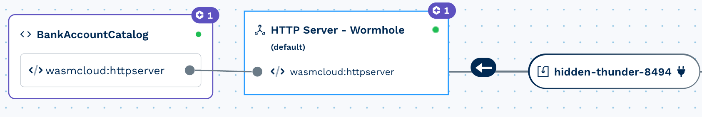

# Bank Account Event Sourcing

[](https://new.cosmonic.app/?yaml=https://raw.githubusercontent.com/cosmonic/awesome-cosmonic/main/bank-account/bank-account.wadm.yaml)

This example illustrates all of the core event sourcing building blocks applied to a simplified banking model. In this sample, we have modeled a bank account aggregate, projector, process manager, and an artificial gateway that can be used for testing simulated inter-bank transfers (processes/sagas). The code for this example can be found [in the Concordance repository](https://github.com/cosmonic/concordance/tree/main/examples/bankaccount).

## Running this Example

Use the above button to deploy this example on Cosmonic, then follow the instructions below to interact with the bank account.

## Viewing the Event Catalog

The Event Catalog UI Actor is deployed alongside the bank account demo. After deploying the example you will have your own [wormhole](https://cosmonic.com/docs/user-guide/glossary#wormhole) to access the UI connected to the `BankAccountCatalog` actor. Check the logic view for a similar view to below:



From here you can explore the different commands and events that this example uses during its lifecycle. Below we'll be using the `CreateAccount`, `DepositFunds`, and `WithdrawFunds` commands, see if you can find them in the Event Catalog.

## Interacting with the Example

Prerequisites:

- [NATS CLI](https://github.com/nats-io/natscli)
- [cosmo CLI](https://cosmonic.com/docs/getting-started/get-the-cli#2a-cli-and-local-running-of-wasm-apps)

First, use `cosmo login` to download your credentials and configure your local cosmo CLI. You'll use these credentials to interact with the bank account demo. Once you log into the UI and authenticate locally, there should be credentials in your `$HOME/.cosmo` directory.

```console
$ ls ~/.cosmo/user.creds
/path/to/home/.cosmo/user.creds
```

To test your credentials, check that you can see the `CC_EVENTS` and `CC_COMMANDS` stream:

```
nats --creds ~/.cosmo/user.creds -s connect.cosmonic.sh --domain cosmonic stream ls --json
```

```text
[
  "CC_COMMANDS",
  "CC_EVENTS"
]
```

Once you can see those two streams, you're ready to create a bank account and make some transactions.

### Creating a Bank Account

In a traditional application, you may create an account by making a request to an API endpoint, and the API will respond that it created the account. An event sourced system works by sending commands to an aggregate which will emit events to the event stream. The events in the stream are an **immutable fact**, which is perfect for critical data like the number in a bank account statement. Let's create an account using the NATS CLI:

```console
nats --creds ~/.cosmo/user.creds -s connect.cosmonic.sh req cc.commands.bankaccount '{"command_type":"create_account","key":"ABC123","data":{"accountNumber":"ABC123","initialBalance":4000,"minBalance":100,"customerId":"COSMONAUT"}}'
```

You should see output like the following:

```console
14:13:15 Sending request on "cc.commands.bankaccount"
14:13:15 Received with rtt 18.966458ms
{"stream":"CC_COMMANDS", "domain":"cosmonic", "seq":1}
```

Notice that the account wasn't _technically_ created by the command, it was simply received by Concordance. You can see the fact that we created an account in the events stream:

```console
nats --creds ~/.cosmo/user.creds -s connect.cosmonic.sh --domain cosmonic stream view CC_EVENTS
```

```console
[1] Subject: cc.events.account_created Received: 2023-11-03T13:13:01-04:00

{"specversion":"1.0","id":"17299b60-3174-4531-b7ee-4e2478ddf7ca","type":"account_created","source":"concordance","datacontenttype":"application/json","time":"2023-11-03T17:13:01.520474404Z","data":{"accountNumber":"ABC123","customerId":"COSMONAUT","initialBalance":4000,"minBalance":100},"x-concordance-stream":"bankaccount"}
```

Now that the account is created, you can freely make transactions against it. Let's deposit some money and make a few transactions:

```console
nats --creds ~/.cosmo/user.creds -s connect.cosmonic.sh req cc.commands.bankaccount '{"command_type":"deposit_funds","key":"ABC123","data":{"accountNumber":"ABC123","amount":3000,"note":"cash deposit","customerId":"COSMONAUT"}}'
nats --creds ~/.cosmo/user.creds -s connect.cosmonic.sh req cc.commands.bankaccount '{"command_type":"deposit_funds","key":"ABC123","data":{"accountNumber":"ABC123","amount":2000,"note":"cash deposit","customerId":"COSMONAUT"}}'
nats --creds ~/.cosmo/user.creds -s connect.cosmonic.sh req cc.commands.bankaccount '{"command_type":"withdraw_funds","key":"ABC123","data":{"accountNumber":"ABC123","amount":1000,"note":"atm withdrawal","customerId":"COSMONAUT"}}'
```

Since the initial balance was 4000, we should now have 8000 (4000 + 3000 + 2000 - 1000). Let's check the balance:

```console
nats --creds ~/.cosmo/user.creds -s connect.cosmonic.sh --domain cosmonic kv get CC_STATE agg.bankaccount.ABC123
```

```console
CC_STATE > agg.bankaccount.ABC123 created @ 03 Nov 23 18:13 UTC

{"balance":5000,"min_balance":100,"account_number":"ABC123","customer_id":"COSMONAUT","reserved_funds":{}}
```

And finally, we can inspect the events stream to see the immutable ordered record of the transactions:

```console
nats --creds ~/.cosmo/user.creds -s connect.cosmonic.sh --domain cosmonic stream view CC_EVENTS
```

## Moving forward

All of the interaction with the bank account sample is done with the NATS CLI, we're working on a nice UI to interact with the sample to simplify some of the process. What you can see by getting familiar with the CLI is just how the inner workings of the system interact with each other and how that manifests in the immutable event stream. Even if you were to spin down this application, delete all state, and spin it back up, the events would still be there and the key-value state would be reconstructed from the events. This is the power of event sourcing as a pattern, and the power of Cosmonic as a platform.
